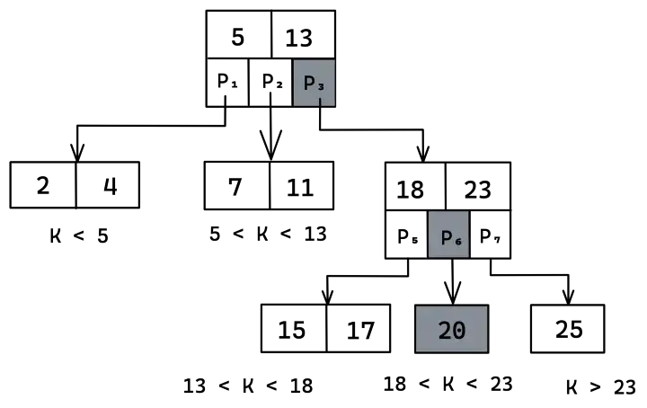

# 1000 라인의 코드로 NOSQL database를 바닥부터 만들어보자.

## Chapter1
앞으로 go언어로 간단한 NOSQL databawe를 만들 것이다. database의 컨셉을 알려주고, go언어로 NOSQL key/value database를 만드는 데 이 컨셉들을 사용할 수 있는 지 알려줄 것이다. 우리는 다음과 같은 질문에 대해 답을 할 것이다.

1. NOSQL이란 무엇인가?
2. disk에 어떻게 데이터를 저장하는가?
3. disk-based와 in-momory database의 차이는 무엇인가??
4. index들은 어떻게 만들어 지는가??
5. ACID란 무엇이고, transaction은 어떻게 동작하는가?
6. 최적의 성능을 위해 디자인된 database란 무엇인가?

첫번째로 우리의 데이터베이스에 사용할 컨셉들의 overview에 대해서 시작해보고, disk에 쓰는 기본적인 매커니즘을 구현하도록 한자.

### SQL vs NOSQL
database는 다른 카테고리들로 나뉘는데, 일반적으로 많이 사용되는 것은 Relational databases (SQL), key-value store, and document store(이를 NOSQL라고 한다.) 이들의 가장 큰 차이는 database에서 사용하는 data model이 무엇이냐는 것이다.


Relational databases에서 비지니스 로직이 database 전체로 확산될 수 있다. 다른 말로, 한 객체의 부분들이 database에 걸쳐 다른 테이블들로 표현될 수 있다. 우리는 '수입'과 '지출'에 대한 다른 테이블을 만들 수 있다는 것이다. 그래서 database에서 '가게'에 대한 전체 entity를 가져오기 위해서는 두 table에 대한 query를 해야할 수 있다.

key-value와 document store는 같은 NOSQL 계열이지만 다르다. 단일 entity의 모든 정보들은 collections/buckets에 모두 집합적으로 저장된다. 가령, '가게'에 대한 정보인 '수입', '지출' 등을 모두 하나의 '가게' 인스턴스에 포함되고, '가게' collection 안에 있다. 

Document stores는 key-value stores의 **subclass**이다. key-value store안의 데이터들은 본질적으로 database에 불투명한 것으로 간주된다. 반면에 document-oriented system은 document’s 내부 구조에 의존한다. 

예를들어, document store에는 내부적인 필드(가령, '수입', '지출')에 의해 모든 '가게' 정보들을 쿼리할 수 있다. 반면에 key-value는 오직 그들의 id에 의해서만 '가게'에 대한 정보를 fetch할 수 있다.


이것이 가장 기본적인 차이지만, 실제로는 database의 여러가지 타입들이 있다. 

우리의 database는 **key-value** store로 (Not document store)로 실제 구현이 매우 단순하고 직관적이다.

### Disk-Based Storage
database들은 그들의 data(collections, documents...)를 ₩database pages`에 구성한다. Pages는 database와 disk에 의해 교환되는 가장 작은 데이터의 단위이다. 고정된 사이즈를 갖는 것은 매우 편리한 방법이다. 또한 이는 연관된 데이터를 근처에 두도록 하여(in proximity), 데이터들을 한 번에 fetch할 수 있도록 한다.

`Database pages`는 disk seeks(디스크에서 데이터를 찾는 시간)을 최소화하기 위해서 연속적으로 디스크에 저장된다. 만약 8개의 shop들이 있고, 단일 page에 2개의 shop들이 점유된다고 하자. 디스크는 다음과 같이 생길 것이다. 


`MYSQL`은 기본적으로 16kb의 페이지 사이즈를 갖고 있고, `Postgres SQL`은 8kb page사이즈를 갖고 있다. 

큰 페이지 사이즈를 갖을 수록 더 좋은 성능을 가지지만, 그러나 `torn pages`를 가질 위험도 갖게 된다. `torn pages`란 단일 쓰기 트랜잭션에서 여러 가지 데이터 베이스의 페이지를 사용하는 동안 시스템이 충돌하면서 특정 페이지가 손상되어 가져올 수 없게 되는 것을 말한다. 

때문에 실제로 page 사이즈를 결정할 때, 이러한 사실들을 가지고 많이 고민을 하게 된다. 그러나 이러한 고민들은 우리의 데이터베이스와는 관계가 없다. 때문에 우리는 데이터베이스 page 사이즈를 임의적으로 4kb로 선택하였다.

### Underlying Data Structure
Database는 다양한 데이터 structure를 사용하여 disk에 page들을 구성하는데 대게 **B/B+ tree**를 사용하거나 **hash buckets**를 사용한다. 각 데이터 structure는 여러 가지 장단점을 가지는데 우리는 **B-tree**를 사용할 것이다. 이유는 구현하기 쉽고, **B-tree***의 원칙(principles)이 현실 세계에서 사용되는 데이터베이스와 흡사하기 때문이다.

### Our Database
우리의 데이터베이스는 key-value store이고, data structure 구조는 **B-tree**이다. 또한, 각 page 사이즈는 4KB이다. 이는 다음의 구조를 갖는다.


**Database**는 우리의 프로그램을 관리하고 transaction들을 오케스트레이션하는 기능의 책임을 진다. 즉, 일련의 read-write 연산을 관리한다는 것이다. 또한, 프로그래머가 database를 사용하는 인터페이스를 제공하고, 그들의 요청을 처리하도록 한다.

**Data Access Layer(DAL)**은 모든 disk와 관련된 연산들을 처리하고, 어떻게 disk에 데이터가 구성되는 지를 처리한다. **DAL**은 기저에 있는 data structure(pages)를 관리하는 책임을 가지며, disk에 database page들을 써주고, fragmentation을 피하기 위해 page를 사용가능한 page를 회수(reclaiming)한다.

우리는 우리의 코드를 bottom-up 방식으로 개발해나갈 것이다. 따라서 Data Access Layer(DAL) 컴포넌트부터 시작을 해보자. `dal.go` 파일을 만들고 다음의 코드를 넣자

- dal.go
```go
package main

import (
	"fmt"
	"os"
)

type dal struct {
	file *os.File
}

func newDal(path string) (*dal, error) {
	dal := &dal{}
	file, err := os.OpenFile(path, os.O_RDWR|os.O_CREATE, 0666)
	if err != nil {
		return nil, err
	}
	dal.file = file
	return dal, nil
}

func (d *dal) close() error {
	if d.file != nil {
		err := d.file.Close()
		if err != nil {
			return fmt.Errorf("could not close file: %s", err)
		}
		d.file = nil
	}
	return nil
}
```
`dal`은 디스크에 있는 file과 긴밀히 데이터를 주고 받아야 하기 때문에 file에 대한 포인터를 갖고, 생애주기까지 담당해준다. `dal`을 만들어주었으니, `dal`에 넣을 데이터가 필요하다. 우리는 데이터를 집어넣기 위해 `page`단위를 도입하기로 하였다. 

database page들을 읽고, 쓰는 일은 `DAL`에 의해 관리되어 진다. 따라서 `page` type을 `dal.go`안에 추가해주도록 하자. `page`는 다음과 같은 구조체 형식을 갖는다.

```go
type pgnum uint64

type page struct {
	num  pgnum
	data []byte
}
```
`page`는 하나의 `num`을 갖는데, 이는 unique한 key로 사용된다. 그러나, 그 보다 더 큰 기능을 하는데, 이 숫자를 사용해서 pointer 연산을하여 특정 page에 접근할 수 있기 때문이다. 가령 각 page의 사이즈(우리는 4kb)를 나타내는 `PageSize`를 이용하여 `PageSize * pageNum`연산과 같이 말이다. 추가적으로 `PageSize`을 `page`의 접근을 관리하는 `dal`에 추가해주도록 하자.

```go
type dal struct {
	file     *os.File
	pageSize int
}

func newDal(path string, pageSize int) (*dal, error) {
	file, err := os.OpenFile(path, os.O_RDWR|os.O_CREATE, 0666)
	if err != nil {
		return nil, err
	}
	dal := &dal{
		file:     file,
		pageSize: pageSize,
	}
	return dal, nil
}
```
이제 `dal`에 read, write연산을 추가해주도록 하자. 

```go
func (d *dal) allocateEmptyPage() *page {
	return &page{
		data: make([]byte, d.pageSize),
	}
}

func (d *dal) readPage(pageNum pgnum) (*page, error) {
	p := d.allocateEmptyPage()

	// page number와 page size를 이용하여 정확하게 해당 페이지의 데이터를 가져온다.
	offset := int(pageNum) * d.pageSize

	//d.file의 데이터에서 p.data의 사이즈만큼, offset에서부터 데이터를 가져온다.
	_, err := d.file.ReadAt(p.data, int64(offset))
	if err != nil {
		return nil, err
	}
	return p, err
}

func (d *dal) writePage(p *page) error {
	// offset만큼 앞을 건너뛴다.
	offset := int64(p.num) * int64(d.pageSize)
	// offset+p.data의 사이즈만큼, 데이터를 써준다.
	_, err := d.file.WriteAt(p.data, offset)
	return err
}
```
`allocateEmptyPage`은 `data`에 `PageSize`만큼의 공간을 할당해준다. 이제 `data`부분에 실제로 데이터를 넣어주면 된다. `readPage`는 file에서 특정 데이터를 가져와 page에 넣어준다. 이 떄 사용되는 `ffset := int(pageNum) * d.pageSize`식을 잘보자, 어렵진 않으나 익숙하지 않으면 힘들다. offset만큼 앞을 건너뛰고, p.data만큼(PageSize) 데이터를 가져오는 것이다. 기본적으로 c언어에서 자주 사용하는 파일읽기 방식이다. `writePage`는 page의 `p.num`과 `PageSize`을 곱해서 offset을 만들고 offset만큼 건너뛰고 file에 p.data을 `PageSize`만큼 써주는 것이다.

### Freelist
page를 관리하는 것은 매우 복잡한 일이다. 우리는 어떤 page가 free되었는 지 알아야하고, 어떤 page가 차지되어 있는 지 알아야 한다. 또한 page들은 훗날 데이터를 해제하여 free될 수 있다. 이러한 경우 우리는 freed된 page를 회수(reclaim)해야하며 이는 `fragmentation`을 피하기 위함이다. 

이러한 모든 로직은 `freelist`에서 담당하기로 한다. 해당 component는 `DAL`의 일부분이다. `freelist`는 `maxPage`라는 counter를 가지고 있는데, 이는 여태까지의 할당된 page 중에 가장 높은 숫자를 말한다. 또한, `releasedPages`라는 리스트를 가지는데, 이는 `released page`를 저장하기 위해 있다.

새로운 페이지가 할당되면 `releasedPage`에서 첫번쨰로 free page에 대해 평가된다. 만약 리스트가 비어있다면 counter는 증가하게되고, 새로운 페이지가 주어지면 file size가 증가하게 된다.


다음과 같이 가장 맨 끝에 저장된 페이지는 `maxPage`로 7번째 page이다. `releasedPages`에 `[5,6]`이 있다면 5,6번째 page는 비어있다는 것이다. 그래서 먼저 page를 할당해주도록 한다. 5,6이 꽉찼다면 7번째 페이지 다음인 8페이지에 데이터를 넣어주면 된다. 그러기 위해서는 7인 `maxPage`와 `PageSize`을 곱한만큼 건너뛰어야 한다.

`freelist.go`을 만들고, `freelist`타입을 만들도록 하자, 그리고 `newFreeList`라는 생성자를 추가해주도록 하자.

- freelist.go
```go
package main

const metaPage = 0

type freelist struct {
	maxPage       pgnum   // 할당된 페이지의 가장 max번째를 기록한다. 따라서 maxPage*PageSize = fileSize이다.
	releasedPages []pgnum // 이전에는 할당되었지만 지금은 free된 페이지의 번호를 기록한다.
}

func newFreelist() *freelist {
	return &freelist{
		maxPage:       metaPage,
		releasedPages: []pgnum{},
	}
}
```
당연히 `maxPage`의 시작은 0이다. 이를 위해 0을 가지고 있는 `metaPage`를 할당해주도록 하자. 왜 `metaPage`라고 하냐면, 우리의 데이터베이스는 첫번째 페이지를 `metadata`를 저장하기위해 사용할 것이기 때문이다. 이에 대한 것은 다음 장에 자세히 설명한다.

이제 `getNextPage`와 `releasePage`를 추가하자. `getNextPage`은 `freelist`의 `maxPage` counter를 +1증가시켜주는 메서드이다. 다만, `releasedPages`가 있다면 굳이 `maxPage`를 쓸 필요없으니 +1을 해주지 않는다. `releasePage`는 `freelist`의 `releasedPages`에 데이터가 해제된 page를 넣어주는 것이다.

```go
func (fr *freelist) getNextPage() pgnum {
	// 먼저 releasedPages로 부터 페이지를 가져온다.
	// 그렇지 않으면, maxium page을 늘려준다.
	if len(fr.releasedPages) != 0 {
		pageID := fr.releasedPages[len(fr.releasedPages)-1]
		fr.releasedPages = fr.releasedPages[:len(fr.releasedPages)-1]
		return pageID
	}
	fr.maxPage += 1
	return fr.maxPage
}

func (fr *freelist) releasedPage(page pgnum) {
	fr.releasedPages = append(fr.releasedPages, page)
}
```
`freelist`를 만들었으니, 이를 사용할 `dal`의 맴버 변수로 넣어주도록 하자.

```go
type dal struct {
	file     *os.File
	pageSize int
	*freelist
}

func newDal(path string, pageSize int) (*dal, error) {
	file, err := os.OpenFile(path, os.O_RDWR|os.O_CREATE, 0666)
	if err != nil {
		return nil, err
	}
	dal := &dal{
		file:     file,
		pageSize: pageSize,
		freelist: newFreelist(),
	}
	return dal, nil
}
```
`freelist`를 `dal`에 넣어주었다. 이제 `main.go`를 만들어서 빈 페이지를 하나 할당한 다음 `dal`을 통해 저장과 불러오기를 해보자.

- main.go
```go
package main

import (
	"fmt"
	"os"
)

func main() {
	dal, _ := newDal("db.db", os.Getpagesize())

	p := dal.allocateEmptyPage()
	p.num = dal.getNextPage()
	copy(p.data[:], "data")
	_ = dal.writePage(p)

	rd, _ := dal.readPage(p.num)
	fmt.Println(string(rd.data))
}
```
`go run ./...` 명령어로 실행한 후, 만들어진 `db.db` 파일을 dump를 통해서 분석해보자.

```
hexdump -C db.db

00000000  00 00 00 00 00 00 00 00  00 00 00 00 00 00 00 00  |................|
*
00001000  64 61 74 61 00 00 00 00  00 00 00 00 00 00 00 00  |data............|
00001010  00 00 00 00 00 00 00 00  00 00 00 00 00 00 00 00  |................|
*
00002000
```
`hexdump`명령어에 `-C` flag를 함께 사용하면 이진 파일의 내용들을 보여준다.

첫번째 줄은 0번째 page로 추후에 있을 metadata 영역이다.

우리의 database가 어느정도 프로그램의 구실을 하게되었는지만 치명적인 문제가 있다. 만약 프로그램을 종료하면 페이지를 어디서부터 할당해야하고, 어떤 페이지들이  free되었는 지 기록할 수 없다는 것이다. 즉, `freelist`는 `disk`에 저장되어야 한다는 것이다. 이것이 바로 다음 챕터에서 다룰 내용이다. 

## chapter2


우리는 disk 연산들을 처리하는 `Data Access Layer`를 만들었다. 지금까지 database file을 열고, 닫고 disk page들에 데이터를 쓰고 읽고를 지원한다. 또한, 비어있는 페이지와 데이터가 있는 페이지를 관리하는 `freelist`를 만들었다.

chapter2에서는 disk에 persistence를 부여해주도록 하자, 이는 database state를 disk에 저장하기 위해 필요한 것이며, 이를 통해 restart에도 연산이 정확하게 동작하게 만들 수 있다. 이에 대한 기능은 `DAL`에서 책임을 지도록 하자.

`freelist`의 상태를 저장하기 위해서, 우리는 `freelist`의 상태를 데이터 베이스의 페이지로 disk에 저장하도록 하자. 이는 database에 대한 metadata를 저장하도록 하는 것이며, 굉장히 많이 사용되는 패턴이다.

우리의 경우 metadata는 freelist의 필수적인 페이지 숫자가 될 수 있고, 이는 또한 파일 포멧을 식별하기 위한 contant number 또는 text value일 수 있다. 우리의 경우 두 가지 모두이다.

`freelist`의 page number를 추적하기 위해서 우리는 `meta`라고 불리는 새로운 페이지를 추가할 것이다. 이는 특별한 페이지이며 0번 페이지에 기록 된다. 우리는 이 database 프로그램을 다시 시작할 때 마다 0번 페이지를 다시 읽어서 `freelist`에 데이터를 로드시켜줄 것이다.

정리하자면 다음과 같다.
```
--------------------
0번째 page = meta data (freelist byte data page number)
...
n번째 page = freelist byte data
--------------------
```
즉 `freelist` 구조체를 바이트로 변환한 후에 페이지에 저장하고, 해당 페이지 번호를 meta구조체가 저장한 다음 0번째 페이지에 써주겠다는 것이다.

### Meta Page Persistence
데이터 베이스의 전형적인 패턴은 `serialize`와 `deserialize` 메서드들을 만들어서 entity를 single page에 맞는 raw data로 변형시켜주도록 하는 것이다. 그리고 이를 entity를 반환하는 reading, writing 메서드에 wrapping하는 것이다.

우리는 `meta.go`라는 새로운 `meta` 타입을 만들고 생성자를 만들도록 하자.

우리는 `meta`를 `[]byte`로 serialize하여 disk에 데이터를 쓸 수 있도록 하는 것이 필요하다. 안타깝게도, go에서는 `Unsafe` 페키지를 사용하는 방법 외에는 `c`에서 하는 방식처럼 구조체를 binary로 쉽게 변경할 수 있는 기능을 제공하지 않는다. 그래서 우리는 이 기능 자체를 우리들이 직접 구현할 것이다.

- meta.go
```go
package main

import "encoding/binary"

const (
	metaPageNum = 0
)

type meta struct {
	freelistPage pgnum
}

func newEmptyMeta() *meta {
	return &meta{}
}

func (m *meta) serialize(buf []byte) {
	pos := 0
	binary.LittleEndian.PutUint64(buf[pos:], uint64(m.freelistPage))
	pos += pageNumSize
}

func (m *meta) deserialize(buf []byte) {
	pos := 0
	m.freelistPage = pgnum(binary.LittleEndian.Uint64(buf[pos:]))
	pos += pageNumSize
}
```
각 메서드에서 position variable인 (`pos`)를 가져 buffer의 position을 추적하도록 한다. 이는 파일에서의 cursor와 비슷한 기능이다. 

우리는 또한, `pageNumSize`를 정의할 필요가 있다. 이는 `pos`가 한번에 `serialize`하고 `deserialize`하는 크기이다. `uint64`만큼 읽으므로 64bit = 8byte만큼이다. 

- const.go
```go
package main

const (
	pageNumSize = 8
)
```
`const.go` 파일은 각 변수을 저장하기 위해 얼마나 많은 bytes들이 사용되는 지를 알려주고, `serialize`와 `deserialize`는 page내에 어디에 데이터를 저장했는 지를 관리한다.

마침내, 위에서 만든 meta `serialize`와 `deserialize`를 사용하여 `writeMeta`와 `readMeta` 메서드를 추가하도록 하자.

- dal.go
```go
func (d *dal) writeMeta(meta *meta) (*page, error) {
	p := d.allocateEmptyPage()
	p.num = metaPageNum
	meta.serialize(p.data)

	err := d.writePage(p)
	if err != nil {
		return nil, err
	}
	return p, nil
}

func (d *dal) readMeta() (*meta, error) {
	p, err := d.readPage(metaPageNum)
	if err != nil {
		return nil, err
	}
	meta := newEmptyMeta()
	meta.deserialize(p.data)
	return meta, nil
}
```
`readMeta` 메서드를 먼저 설명하자면, `metaPageNum`인 0번 페이지를 읽은 다음 `meta` 타입의 인스터스를 하나만들어준다. 이후, `deserialize` 메서드를 통해서 `meta page`의 data를 `meta`의 `freelistPage`에 little endian으로 바이트 정렬해준다. 

프로그램이 끝날 때는 `writeMeta`로 `meta` 타입의 인스턴스를 받고, 새로운 `meta page`를 하나만든 다음. 해당 패이지에 `serialize`해준다.

### Freelist Persistence
우리는 `meta page`를 정의하였고, `freelist` 데이터를 어디에서 찾을 지를 안다. 이제 `freelist` 그 자체를 `reading/writing`해주기 위한 메서드를 추가할 필요가 있다. 이전과 마찬가지로 우리는 `serializaing`과 `deserializing`을 위한 메서드를 추가할 것이다.

- freelist.go
```go
func (fr *freelist) serialize(buf []byte) []byte {
	pos := 0
	binary.LittleEndian.PutUint16(buf[pos:], uint16(fr.maxPage))
	pos += 2

	// released page 개수
	binary.LittleEndian.PutUint16(buf[pos:], uint16(len(fr.releasedPages)))
	pos += 2

	for _, page := range fr.releasedPages {
		binary.LittleEndian.PutUint64(buf[pos:], uint64(page))
		pos += pageNumSize
	}
	return buf
}

func (fr *freelist) deserialize(buf []byte) {
	pos := 0
	fr.maxPage = pgnum(binary.LittleEndian.Uint16(buf[pos:]))
	pos += 2

	// released pages count
	releasedPagesCount := int(binary.LittleEndian.Uint16(buf[pos:]))
	pos += 2

	for i := 0; i < releasedPagesCount; i++ {
		fr.releasedPages = append(fr.releasedPages, pgnum(binary.LittleEndian.Uint64(buf[pos:])))
		pos += pageNumSize
	}
}
```
`serialize`는 데이터가 저장된 가장 끝 페이지의 값인 `fr.maxPage`를 `uint16`으로 `buf`의 2byte에 저장한다. 또한, 비어있는 페이지의 개수를 담은 `releasedPage`도 `buf`에 2byte로 저장한다. 이는 `maxPage`과 `releasedPage`를 2byte씩 저장하는 것이다. 

이후부터는 

`meta` 구조체를 누군가 가지고 있어야 하므로, 이를 `dal`구조체에 넣어주도록 하자.

- dal.go
```go
type dal struct {
	file     *os.File
	pageSize int
	*freelist
	*meta
}
```
이제 `dal`에 `meta`구조체에 있는 page number를 사용하여 `freelist` page를 읽고 쓰는 메서드를 추가하자.

- dal.go
```go
func (d *dal) readFreelist() (*freelist, error) {
	p, err := d.readPage(d.freelistPage)
	if err != nil {
		return nil, err
	}

	freelist := newFreelist()
	freelist.deserialize(p.data)
	return freelist, nil
}

func (d *dal) writeFreelist() (*page, error) {
	p := d.allocateEmptyPage()
	p.num = d.freelistPage
	d.freelist.serialize(p.data)

	err := d.writePage(p)
	if err != nil {
		return nil, err
	}

	d.freelistPage = p.num
	return p, nil
}
```
`writeFreelist`는 `d.freelistPage`번째의 page에 `freelist`를 직렬화한 바이트 코드를 써준다. `readFreelist`는 `d.freelistPage`를 읽어서 `freelist`인스턴스에 값들을 할당해준다.

이제 `dal.go`의 생성자에 `meta`를 사용하여 `freelist`의 값을 저장하고, 불러오게 해보자.

- dal.go
```go

func newDal(path string, pageSize int) (*dal, error) {
	dal := &dal{
		meta:     newEmptyMeta(),
		pageSize: pageSize,
	}
	// exist
	if _, err := os.Stat(path); err == nil {
		dal.file, err = os.OpenFile(path, os.O_RDWR|os.O_CREATE, 0666)
		if err != nil {
			_ = dal.close()
			return nil, err
		}

		meta, err := dal.readMeta()
		if err != nil {
			return nil, err
		}
		dal.meta = meta

		freelist, err := dal.readFreelist()
		if err != nil {
			return nil, err
		}
		dal.freelist = freelist
		// dosen't exist
	} else if errors.Is(err, os.ErrNotExist) {
		// init freelist
		dal.file, err = os.OpenFile(path, os.O_RDWR|os.O_CREATE, 0666)
		if err != nil {
			_ = dal.close()
			return nil, err
		}
		dal.freelist = newFreelist()
		dal.freelistPage = dal.getNextPage()
		_, err := dal.writeFreelist()
		if err != nil {
			return nil, err
		}

		_, err = dal.writeMeta(dal.meta)
	} else {
		return nil, err
	}
	return dal, nil
}
```
먼저 `db.db` 파일이 있는 지를 확인한다. 만약 있을 시에는 `meta page`(0번째 페이지)를 읽어서 `freelist page`(freelist 정보가 있음)가 어디에 있는 지 페이지 번호를 알아낸 다음, `readFreelist`로 `deserialize`한다. 

만약, `db.db` 파일이 없다면, 새로 `freelist`를 만들어주고, `freelist`의 정보를 기록하는 `freelistPage`를 넣어주고, `writeFreelist`를 통해서 `serialize`해준다. 이후, `writeMeta`를 통해서 `m.freelistPage`를 0번째 페이지인 `meta page`에 저장해준다.

이제 해당 코드를 실행해보자.

- main.go
```go
package main

import (
	"fmt"
	"os"
)

func main() {
	dal, _ := newDal("db.db", os.Getpagesize())

	p := dal.allocateEmptyPage()
	p.num = dal.getNextPage()
	copy(p.data[:], "data")

	_ = dal.writePage(p)
	_, _ = dal.writeFreelist()

	// close the db
	_ = dal.close()

	dal, _ = newDal("db.db", os.Getpagesize())
	p = dal.allocateEmptyPage()
	p.num = dal.getNextPage()
	copy(p.data[:], "data2")
	_ = dal.writePage(p)

	pageNum := dal.getNextPage()
	dal.releasedPage(pageNum)

	_, _ = dal.writeFreelist()
}
```
먼저 `db.db`를 열고, `data` 페이지에 기록해준다. 그 다음 `dal`연결을 종료한 뒤에 두번째 데이터인 `data2`를 기록한다. 이후 `dal.releasedPage`로 그 다음 페이지를 할당 해제시켜보자. 마지막으로 `dal.writeFreelist()`으로 현재까지의 `freelist` 정보를 `db.db`에 저장시키자.

이렇게 하면, 무조건 맨처음에 시작할 때, `freelistPage` 정보를 기록한다. 따라서 0번째 page는 meta data, 1번째 page는 `freelist`정보이다. 그 다음 2번째, 3번째 페이지에 각각 `data` , `data2` 가 할당된다. 이 후 4번째 `page`는 재할당 되므로 `freelist`에 기록된다. 

`db.db` 내용을 확인해보자.
```
hexdump -C db.db

00000000  01 00 00 00 00 00 00 00  00 00 00 00 00 00 00 00  |................|
00000010  00 00 00 00 00 00 00 00  00 00 00 00 00 00 00 00  |................|
*
00001000  04 00 01 00 04 00 00 00  00 00 00 00 00 00 00 00  |................|
00001010  00 00 00 00 00 00 00 00  00 00 00 00 00 00 00 00  |................|
*
00002000  64 61 74 61 00 00 00 00  00 00 00 00 00 00 00 00  |data............|
00002010  00 00 00 00 00 00 00 00  00 00 00 00 00 00 00 00  |................|
*
00003000  64 61 74 61 32 00 00 00  00 00 00 00 00 00 00 00  |data2...........|
00003010  00 00 00 00 00 00 00 00  00 00 00 00 00 00 00 00  |................|
*
00004000
```
`freelist`정보가 기록된 1번째 페이지에 `04 00`은 가장 끝에 있는 페이지의 값을, `01 00`은 released 된 페이지의 수를, `04` released된 페이지의 번호이다.

이후 계속 `main.go`프로그램을 실행하면 데이터가 추가되고 변경되는 것을 확인할 수 있다.

다음 챕터에서는 `B-Tree`에 대해서 알아보고, 이를 활용해 어떻게 데이터를 저장하고 불러오는 지 알아보도록 하자.

## chapter 3
우리의 데이터를 database에서 disk에 저장하는 것을 완료하였고, 해당 데이터를 읽고 쓰는 기능까지도 구현하였다. 그러나 우리는 데이터를 관리하는 것에 대해서 좀 더 숙고할 필요가 있는데, 우리가 database로 부터 데이터를 가져올 때, 이 데이터가 어디서부터 오는 지 잘 생각해봐야한다.

database의 꽃이라고 불리는 b tree를 사용해서 어떻게 데이터가 구성되는 지 알아보도록 하자. 

### Binary Search Tree
이진 탐색 트리(binary search tree, BST)는 정해진 순서로 데이터를 저장하기위해 사용되는 데이터 자료구조이다. 트리의 각 노드는 키로 식별되며, 이 키에 관련된 값들과 다음 child node들을 가리키는 두 개의 포인터로 구성된다. 각 노드의 left child node은 반드시 parent node보다도 작아야하고, right child node는 반드시 parent node보다 커야 한다.


이러한 방식을 따라서 우리는 우리가 찾는 값을 쉽게 찾을 수 있다. 우리의 찾는 값이 현재의 노드보다 작다면 왼쪽 노드로 크다면 오른쪽 노드로 가면 되기 때문이다.

이진 탐색 트리는 빠른 lookup과 추가, 삭제를 제공한다. 각 비교 한 번 씩마다 비교할 데이터의 후보군이 반씩 줄어들기 때문이다.

그럼 왜 우리는 굳이 이진 탐색 트리를 사용해야할까? 우리는 여태까지 텍스트 파일에 데이터(page)를 순차적으로 썼다. 이는 쓰기 연산에 대해서는 굉장히 빠르다. 즉, 새로운 데이터가 추가되면 파일의 마지막 부분에 넣으면 된다. 반면에, 특정 아이템을 읽는 것은 전체 파일을 검색해야한다. 만약 우리의 파일이 점점 커지면, 읽기 연산은 더 긴 시간이 걸릴 수 밖에 없다.

이진 탐색 트리(BST)는 이전의 방식보다는 쓰기 연산은 느리지만, 읽기 연산은 빠르다. 이러한 균형잡힌 방식은 일반적으로 데이터 베이스에 자주 사용된다. 

또 다흔 주안점은 disk access라는 것이다. disk에 있는 데이터 구조를 설계할 때는, disk에 대한 접근이 최소화되어야 한다.

이진 탐색 트리는 2개의 child를 가진다. 그래서 tree의 level이 5라면 2^5=32개의 item들을 가진다. 이 경우 트리에서 아이템을 찾는 것은 가장 최악의 경우 5번 밖에 안걸린다. 이는 다시 말해 5번의 disk access가 있다는 것이다. 그러나, 이는 트리가 균형잡혔을 때이고, 만약 tree의 높이가 32라면 32번의 disk access가 필요하다.


다음과 같은 경우가 최악의 경우이다.

어떻게 이진 탐색 트리의 높이를 최적으로 유지할 수 있을까?? 이를 위해 제시된 트리들이 AVL, red-black tree, b tree 등이 있다. database에서는 주로 b tree를 사용하므로 이에 대해서 알아보자.

### B-Tree
b tree는 m order 트리하고 불리는데, 하나의 노드마다 최대 m-1개의 key를 가진다. b tree를 사용하는 주된 이유 중 하나는, 비교적 작은 트리의 높이를 유지함으로서, 단일 노드에 많은 수의 key들과 key-value들을 저장하는 기능이다.

b tree가 order m개의 order를 가진다면 다음과 같은 특징이 있다.

1. b tree의 모든 노드은 최대 m개의 child node를 가질 수 있다.
2. root노드와 leaf 노드를 제외한 b tree의 모든 노드들은 반드시 최소한 [m/2]개의 child node를 가져야 한다. 
3. root node는 최소한 2개의 node들을 가져야 한다. 
4. 모든 leaf노드들은 반드시 같은 level로 이루어져야 한다.

모든 노드에 동일한 수의 child node가 포함될 필요는 없지만, 각 node에는 m/2개의 노드가 있어야 한다.

다음은 4 order b-tree이다.


데이터를 넣고, 삭제하다보면 위에서 제시한 b-tree의 조건들이 위배될 때가 있다. 이를 해결하기 위해서는 `split`과 `join`이 필요하다.

### Searching

b tree로 데이터를 찾는 것은 아진 탐색 트리와 비슷하다. 다음의 b tree에서 49를 찾는다고 하자.

1. item 49와 root node 78을 비교한다.49 < 78이므로 왼쪽으로 내려간다.
2. 40 < 49 < 56이기 때문에, 가운데로 간다.
3. 49 > 45이기 때문에 오른쪽으로 이동하여 49와 비교한다.
4. 값을 찾았다.

b-tree에서의 검색은 b tree의 높이에 의존한다. 따라서 검색 알고리즘은 O(logn) 시간이 걸린다.


### Inserting
삽입은 leaf 노드 레벨에서 이루어진다. 다음의 알고리즘은 b-tree에 item을 삽입하기 위해서 이루어져야 할 부분이다.

1. 데이터가 삽입될 수 있는 적절한 leaf 노드를 찾기위해서 b-tree를 순회한다.
2. 만약 leaf node가 m-1 key들 보다 적다면 오름차순으로 데이터를 삽입한다.
3. 만약 leaf node가 m-1 key를 갖는다면, 다음의 과정을 거친다.
   1. 새로운 데이터를 오름차순으로 삽입한다.
   2. 중간값을 기준으로 node를 두 개의 노드들로 나눈다.
   3. 중간값은 parent node로 넣어준다. 
   4. 만약 parent node또한 m-1 key를 가진다면 위와 같은 똑같은 작업을 반복한다.

order 5짜리 b-tree에 데이터 8을 삽입해보자.


8은 5오른쪽에 삽입될 것이다. 삽입해보자.


노드가 현재 5개의 key값들을 갖고 있다. 이는 5-1개의 키까지만 가져야 한다는 법칙을 어긴다. 그러므로 node를 중간값인 8을 기준으로 `split`(나누기)해야한다. 8은 부모노드로 올리고 나머지는 두개 의 child node로 만든다.


### Deletion
삭제 또한 leaf node에서 동작한다. 물론 삭제 대상이 되는 노드는 leaf node가 아니라 internal node일 수 있지만, 삭제하기 편하도록 leaf 노드와 치환하여 삭제하는 것이다. 다음의 알고리즘을 따라가 보자.

1. leaf 노드에 두고
2. 만약 leaf 노드안에 m/2 키 이상이 있다면 node노 부터 원하는 키를 삭제한다.
3. 만약 leaf 노드가 m/2 키들을 포함하고 있지 않으면, 오른쪽 또는 왼쪽 노드로 부터 요소를 가져온다.
   1. 만약 왼쪽 노드가 m/2 이상 요소들을 가지고 있다면 그 중에 가장 큰 요소를 parent로 올리고, 간섭(intervening, parent) 요소를 키가 삭제된 노드로 이동한다.
   2. 만약 오른쪽 노드가 m/2 이상 요소들을 가지고 있다면 그 중 가장 작은 요소를 parent로 올리고, 간섭(intervening, parent)요소를 키가 삭제된 노드로 이동한다.
4. 만약 양쪽 노드 중 어느 노드도 m/2개의 요소들을 갖고 있지 않으면, 두 개의 leaf 노드들을 joining하고 parent node에 간섭함으소 새로운 leaf node를 만든다.
5. 만약 parent의 left가 m/2개의 노드보다 작다면 위의 작업을 parent도 반복한다.

만약, leaf node가 아닌 internal node를 삭제하려고 한다면 해당 node를 in-order successor(현재 노드의 오른쪽 child node 중 가장 작은 값, 즉 삭제하려고 하는 값의 바로 다음 값)로 교체하거나 predecessor(현재 노드의 왼쪽 child node 중 가장 큰 값, 즉 삭제하려고 하는 값의 바로 이전 값)로 교체한다. 때문에 successor or predecessor는 항상 leaf node에 있을 것이며, leaf노드 삭제 로직과 동일하게 동작할 것이다. 

노드 53를 order 5인 b-tree에서 53을 삭제한다고 하자. 


53은 49의 오른쪽 child node이다. 이를 삭제하도록 하자.


현재 삭제된 노드는 오직 57밖에 남지 않았다. 각 노드에 최소로 m/2개의 노드가 있어야하는데 5/2 = 2이므로, 1개 밖에 없는 노드는 다른 노드에서 값을 빌려와야 한다. 그런데, 해당 노드의 왼쪽 노드(23,34), 오른쪽 노드(69,74) 모두 m/2개 이므로 값을 빌려올 수가 없다. 이때에는 왼쪽 또는 오른쪽 노드와 merge(합치기)을 하면 된다. 왼쪽 노드를 선택하면, parent node에서 49가 이들 사이에 있으니까 49도 포함해서 합쳐주면 된다.


그럼 만약, 왼쪽 노드가 23,34,35로 충분한 요소들을 갖고 있었다면 어떻게 될까?? 왼쪽 노드에서 35를 parent로 올리고 parent에서 49를 삭제가 진행된 노드로 내리면 된다.

### coding
이제 우리의 b-tree를 작성할 시간이 되었다. 우리는 `node`에 key-value를 저장할 것이고, key를 기준으로 정렬할 것이다. 그리고 	`node`와 관련된 key-value와 child값 등등을 `page`의 `data`에 저장하도록 할 것이다. 이렇게 함으로서 `page`에는 `b-tree`의 `node` 정보를 갖고 있어, `page`를 불러오는 것만으로도 `b-tree`를 구성하고 데이터를 서치하기 쉽게 만들 수 있다.  


새로운 파일인 `node.go` 파일을 만들고 새로운 타입인 `Node` 타입을 만들어서 b tree의 node를 표현하자. 또한 `Item` 타입을 만들어서 key-value 쌍을 표현하도록 하자.

- node.go
```go
package main

type Item struct {
	key []byte
	value []byte
}

type Node struct {
	*dal
	pageNum pgnum
	items []*Item
	childNodes []pgnum
}

func NewEmptyNode() *Node {
	return &Node{}
}

func newItem(key []byte, value []byte) *Item {
	return &Item{
		key: key,
		value: value,
	}
}

func (n *Node) isLeaf() bool {
	return len(n.childNodes) == 0
}
```
우리는 `Node`의 내용들을 disk에 `page`의 `data`로 저장하기를 원한다. 이는 key-value-child pointer라는 3쌍둥이를 하나의 page로 저장하는 단순한 일로 보이지만, 이는 실제로 큰 문제점이 있다.

item들은 서로 다른 key, value들을 갖는다. 이는 key-value 쌍들을 순회하는 것이 그리 간단한 작업이라는 것이 아니라는 것을 의미한다. 우리는 각 순회마다 얼만큼 byte를 잡아야 다음 커서로 넘어가는 지를 모르기 때문이다.


페이지들은 p로 표시되고, key들은 k, value들은 v로 표시된다.

이러한 문제를 해결하기 위해 우리는 `slotted pages`라는 테크닉을 사용할 것이다. 페이지를 두 가지 메모리 영역으로 나누는 방법이다. page의 끝에는 key와 value들로 이루어져 있고, 반면에 첫부분은 record의 fixed 사이즈의 offset이 있는 것이다.

우리는 또한 헤더를 추가하여 page에 record 수를 포함할 것이다. 그리고 해당 페이지가 leaf인지 아닌지를 알려주는 flag또한 넣을 것이다. (왜냐면, leave들은 child pointer를 갖지 않기 때문이다.)


이러한 디자인은 최소한의 노력으로 page에 대한 변화를 가능하게 해준다. logical order은 cell offset들을 저장함으로서 지켜진다. 따라서 data는 다시 재개록 될 필요가 없다.

각 노드들은 단일 페이지로 serialized된다. 그러나 두 개의 차이를 이해하는 것은 매우 종요하다.

`Node`는 오직 key-value 쌍을 포함하고 higher-level에서 사용되는 것이다. 반면에 `Page`는 storage level에서 동작하며 크기가 4KB인 모든 데이터 유형을 저장한다. 이는 또한 key-value 쌍으로 구성된 `slotted page` 구조와 덜 엄격한 구조로 놓여진 `freelist`와 `meta`를 포함할 수 있다.

### Nodes Persistence
이전 챕터에서 했듯이 우리는 database node의 serialization과 deserialiation을 추가할 것이다. 이 메서드들은 데이터를 slotted page format으로 만들거나, slotted page format에서 data로 변경해준다.

- node.go
```go
func (n *Node) serialize(buf []byte) []byte {
	leftPos := 0
	rightPos := len(buf) - 1

	// Add page header: isLeaf, key-value pairs count, node num
	isLeaf := n.isLeaf()
	var bitSetVar uint64
	if isLeaf {
		bitSetVar = 1
	}
	buf[leftPos] = byte(bitSetVar)
	leftPos += 1

	binary.LittleEndian.PutUint16(buf[leftPos:], uint16(len(n.items)))
	leftPos += 2

	// We use slotted pages for storing data in the page. It means the actual keys and values (the cells) are appended
	// to right of the page whereas offsets have a fixed size and are appended from the left.
	// It's easier to preserve the logical order (alphabetical in the case of b-tree) using the metadata and performing
	// pointer arithmetic. Using the data itself is harder as it varies by size.

	// Page structure is:
	// ----------------------------------------------------------------------------------
	// |  Page  | key-value /  child node    key-value 		      |    key-value		 |
	// | Header |   offset /	 pointer	  offset         .... |      data      ..... |
	// ----------------------------------------------------------------------------------
	for i := 0; i < len(n.items); i++ {
		item := n.items[i]
		if !isLeaf {
			childNode := n.childNodes[i]

			// Write the child page as a fixed size of 8 bytes
			binary.LittleEndian.PutUint64(buf[leftPos:], uint64(childNode))
			leftPos += pageNumSize
		}

		klen := len(item.key)
		vlen := len(item.value)

		//write offset
		offset := rightPos - klen - vlen - 2
		binary.LittleEndian.PutUint16(buf[leftPos:], uint16(offset))
		leftPos += 2

		rightPos -= vlen
		copy(buf[rightPos:], item.value)

		rightPos -= 1
		buf[rightPos] = byte(vlen)

		rightPos -= klen
		copy(buf[rightPos:], item.key)

		rightPos -= 1
		buf[rightPos] = byte(klen)
	}

	if !isLeaf {
		lastChildNode := n.childNodes[len(n.childNodes)-1]
		binary.LittleEndian.PutUint64(buf[leftPos:], uint64(lastChildNode))
	}
	return buf
}
```
`serialize`메서드를 만들었으니 `deserialize`메서드도 만들어주도록 하자.
```go
func (n *Node) deserialize(buf []byte) {
	leftPos := 0

	// read header
	isLeaf := uint16(buf[0])

	itemsCount := int(binary.LittleEndian.Uint16(buf[1:3]))
	leftPos += 3

	for i := 0; i < itemsCount; i++ {
		if isLeaf == 0 {
			pageNum := binary.LittleEndian.Uint64(buf[leftPos:])
			leftPos += pageNumSize

			n.childNodes = append(n.childNodes, pgnum(pageNum))
		}

		// read offset
		offset := binary.LittleEndian.Uint16(buf[leftPos:])
		leftPos += 2

		klen := uint16(buf[int(offset)])
		offset += 1

		key := buf[offset : offset+klen]
		offset += klen

		vlen := uint16(buf[int(offset)])
		offset += 1

		value := buf[offset : offset+vlen]
		offset += vlen

		n.items = append(n.items, newItem(key, value))
	}

	if isLeaf == 0 {
		pageNum := pgnum(binary.LittleEndian.Uint64(buf[leftPos:]))
		n.childNodes = append(n.childNodes, pageNum)
	}
}
```
딱히 특별할 것은 없다. 

우리는 또한 node를 반환하기 위해서 `getNode`, `writeNode` 그리고 `deleteNode`를 추가할 것이다. `getNode`와 `writeNode`는 `node` 구조체 자체를 반환하는데, 우리가 이전에 했던 `freelist`와 `meta`가 했던 것과 같다.


`deleteNode`는 `freelist`에게 어떤 노드가 삭제될 수 있다는 신호를 보낸다. 그래서 해당 page id가 released되도록 표시해둘 수 있다.

페이지에 우리가 만든 `node` 구조채 정보를 넣어주도록 하는 것이 `getNode`가 되고, `node`구조체의 값을 `page`에 써넣는 것이 `writeNode`가 되겠다.
- dal.go
```go
func (d *dal) getNode(pageNum pgnum) (*Node, error) {
	p, err := d.readPage(pageNum)
	if err != nil {
		return nil, err
	}

	node := NewEmptyNode()
	node.deserialize(p.data)
	node.pageNum = pageNum
	return node, nil
}

func (d *dal) writeNode(n *Node) (*Node, error) {
	p := d.allocateEmptyPage()
	if n.pageNum == 0 {
		p.num = d.getNextPage()
		n.pageNum = p.num
	} else {
		p.num = n.pageNum
	}

	p.data = n.serialize(p.data)

	err := d.writePage(p)
	if err != nil {
		return nil, err
	}
	return n, nil
}

func (d *dal) deleteNode(pageNum pgnum) {
	d.releasedPage(pageNum)
}
```
`node`들의 정보를 `page`에 저장하고 불러오는 기능들까지 모두 구현하였다. 이제 `node`들로 `b-tree`를 만들고 `key`를 통해 값을 가져오고, `node`를 정렬하며 삭제하는 방법들을 알아보자.

### Search, Insert, and Delete
search, insert, delete를 위한 알고리즘을 구현하기 이전에 node를 쓰고, 읽기 위한 수많은 call들이 만들어질 것이기 때문에, `dal` layer에 만든 코드를 `node`로 wrapping하도록 하자.

```go
func (n *Node) writeNode(node *Node) *Node {
	node, _ = n.dal.writeNode(node)
	return node
}

func (n *Node) writeNodes(nodes ...*Node) {
	for _, node := range nodes {
		n.writeNode(node)
	}
}

func (n *Node) getNode(pageNum pgnum) (*Node, error) {
	return n.dal.getNode(pageNum)
}
```

### Search
b-tree를 검색하는 것은 이진 탐색으로 이루어진다. root node로부터 알고리즘이 시작되고, 검색된 값보다 큰 첫번째 키를 찾을 때까지 모든 키를 travel시킨다. 그러고 나서 우리는 관련된 서브트리 쪽으로 상응하는 child pointer를 이용하여 내려간다. 그리고 이 과정을 반복한다.


가령, 20이 주어지면 첫번째 단계에서 20과 정확히 맞는 키가 없다. 그래서 알고리즘은 13보다 더 큰 값으로 가야하므로 p3 포인터를 타고 내려간다. 두 번째 단계에서는 20이 18보다는 크고, 23보다는 작으므로 p6로 가게되고 20을 찾게 된다.

`findKeyInNode` 함수는 위의 예제와 같이 node안의 key를 찾는다. 각 레벨에서 key들을 찾는 key와 비교한다. 만약 찾게되면 funtion은 값을 반환하고, 만약 key를 찾지 못하면 정확한 범위를 반환한다.

- node.go
```go
// findKeyInNode iterates all the items and finds the key. If the key is found, then the item is returned. If the key
// isn't found then return the index where it should have been (the first index that key is greater than it's previous)
func (n *Node) findKeyInNode(key []byte) (bool, int) {
	for i, existingItem := range n.items {
		res := bytes.Compare(existingItem.key, key)
		if res == 0 {
			return true, i
		}
		// The key is bigger than the previous key, so it doesn't exist in the node, but may exist in child nodes.
		if res == 1 {
			return false, i
		}
	}
	// The key isn't bigger than any of the keys which means it's in the last index.
	return false, len(n.items)
}
```
`bytes.Compare` 메서드는 a와 b 바이트를 `lexicographically`(사전순으로) 비교해주는데, 만약 서로 같으면 0, a < b이면 -1을, a > b이면 +1을 반환한다.

즉, 우리는 node에서의 key와 찾으려는 key를 비교하여 child pointer의 인덱스를 넘겨준다. 따라서, 매칭되면 더이상 child pointer로 나아갈 이유가 없으므로 `true`를 반환해주고, res가 1이 나오면 찾으려는 key가 현재 node의 키보다 작으므로 `false`와 이전 child pointer인 `i`를 반환한다. 만약 `for`을 모두 순회하고도 결과가 안나왔다면 res는 여태까지 `-1`만 나왔다는 것이다. 이는 `a<b`라는 의미로, 현재 node의 키값보다 찾으려는 키값이 더 크다는 의미이므로, `child pointer`로 `len(n.items)`를 반환해주는 것이다.

다만 현재의 코드는 `node`안에서만 키값을 비교하면서 찾는 것이다. 이제 `b-tree`의 모든 노드를 순회하도록 하자. 

`b-tree`의 순회는 이진 탐색과 다를 바가 없다. 오직 차이점은 검색이 많은 Child들로 이루어져 있다는 것과 투개로만 이루어져 있다는 게 아니라는 것이다.

```go
// findKey searches for a key inside the tree. Once the key is found, the parent node and the correct index are returned
// so the key itself can be accessed in the following way parent[index].
// If the key isn't found, a falsey answer is returned.
func (n *Node) findKey(key []byte) (int, *Node, error) {
	index, node, err := findKeyHelper(n, key)
	if err != nil {
		return -1, nil, err
	}
	return index, node, nil

}

func findKeyHelper(node *Node, key []byte) (int, *Node, error) {
	//Search for the key inside the node
	wasFound, index := node.findKeyInNode(key)
	if wasFound {
		return index, node, nil
	}
	// If we reached a leaf node and the key wasn't found, it means it doesn't exist.
	if node.isLeaf() {
		return -1, nil, nil
	}
	// Else keep searching the tree
	nextChild, err := node.getNode(node.childNodes[index])
	if err != nil {
		return -1, nil, err
	}
	return findKeyHelper(nextChild, key)
}
```
`fineKey`함수는 `findKeyHelper` 함수의 wrapper이다. `findKeyHelper`는 제귀적으로 `node`를 따라가서 검색 알고리즘을 해준다.

`root`노드로 부터 시작되어야 하지만, `root`노드에는 parent node가 없다. 따라서 어딘가에 `root` node에 대한 정보를 기록해야하므로 `meta`에 `root`정보를 기록하도록 하자.

`root` 노드의 page number를 `meta`에 저장하도록 하자.

- meta.go
```go
type meta struct {
	root         pgnum
	freelistPage pgnum
}

func newEmptyMeta() *meta {
	return &meta{}
}

func (m *meta) serialize(buf []byte) {
	pos := 0

	binary.LittleEndian.PutUint64(buf[pos:], uint64(m.root))
	pos += pageNumSize

	binary.LittleEndian.PutUint64(buf[pos:], uint64(m.freelistPage))
	pos += pageNumSize
}

func (m *meta) deserialize(buf []byte) {
	pos := 0
	m.root = pgnum(binary.LittleEndian.Uint64(buf[pos:]))
	pos += pageNumSize

	m.freelistPage = pgnum(binary.LittleEndian.Uint64(buf[pos:]))
	pos += pageNumSize
}
```
이제 `root`도 기록하였고, 우리의 메서드를 테스트해보도록 하자. 우리의 DB는 이제 `B-Tree`를 활용하여 검색을 시도할 것이고, `B-Tree` 형식안에 놓여져 있는 database page를 반환하게 된다.

우리는 아직 `B-tree`를 만들 방법이 없다. 그래서 `mainTest`라는 mock file을 준비해두었다. 이 파일은 `key-value`쌍을 포함하고 있다. `key`는 "Key1"이고 `value`는 "Value1"이다.

그전에 `newDal`의 일부분을 다음과 같이 변경하도록 하자.

- dal.go
```go
func newDal(path string) (*dal, error) {
	dal := &dal{
		meta:     newEmptyMeta(),
		pageSize: os.Getpagesize(),
	}
	...
}
```

이제 `main.go` 코드를 변경하여 `mainTest₩를 사용할 수 있도록 하자.

- main.go
```go
package main

import "fmt"

func main() {
	dal, _ := newDal("./mainTest")

	node, _ := dal.getNode(dal.root)
	node.dal = dal
	index, containingNode, _ := node.findKey([]byte("Key1"))
	res := containingNode.items[index]

	fmt.Printf("key is: %s, value is: %s\n", res.key, res.value)
	_ = dal.close()
}
```
이제 코드를 실행하여 `Key1`, `value1`이 나오면 우리가 만든 `b-tree` node의 구조와 순회, 검색, 저장, 불러오기 등이 잘 만들어진 것을 확인할 수 있다.